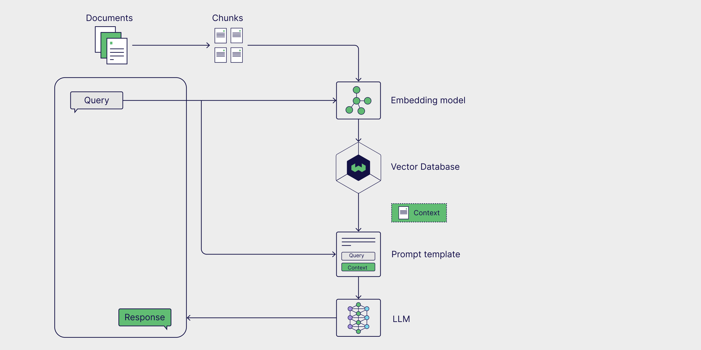

# TutorTron

## AI-Powered Assistant for Instant Academic Support and Interactive Learning

TutorTron is designed to offer seamless support and an interactive learning experience. Follow these instructions to set up and run the application. This tool is initially created as a project in McMatser University to help students with their academic resources.

### Pipeline
The following picture shows a simple RAG (Retrieval-Augmented Generation) pipeline, where a user submits a query, and the system retrieves relevant information from a knowledge base before generating a response. First, documents are broken into smaller chunks and processed by an embedding model, which converts them into numerical representations. These embeddings are stored in a vector database, allowing for efficient retrieval of the most relevant chunks when a query is made. The retrieved content is then combined with the original query into a structured prompt, which is sent to a large language model (LLM). The LLM generates a response using both the query and retrieved context, improving accuracy and relevance.


Image Source: [Weaviate Blog](https://weaviate.io/blog/introduction-to-rag)

Before running the this chatbot you should do the following steps:
1. Import user data from a CSV file into a database by following the steps from [this section](#handling-the-users).
2. Prepare all the files in a directory, chunk them, embed them and store them in a [Pinecone](https://www.pinecone.io/) vector databa by following the steps from [this section](#preparing-the-knowledge-base).
3. To deploy the chatbot, refer to the [Deployment](#deployment) section.

You also need access to the following services:

1. [OpenAI API](https://platform.openai.com/) for the LLM and embedding model (a paid service).
2. [Pinecone](https://www.pinecone.io/) for the vector database (offers a free tier).
3. [Supabase](https://supabase.com/) for the database (offers a free tier).

You should have a `.env` file in the root directory of the project with the following environment variables:

```shell
OPENAI_API_KEY="<your_openai_api_key>"
PINECONE_API_KEY="<your_pinecone_api_key>"
SUPABASE_KEY="<your_supabase_key>"
SUPABASE_URL="<your_supabase_url>"
```

### Usage

You have two options for using TutorTron:
1. Run it locally on your machine or on a server.
2. Deploy the application using [Streamlit Community Cloud](https://streamlit.io/cloud).

For the first option, follow the steps mentioned in the previous section. Then, simply install the dependencies and run the application using the following commands:

```shell
pip install -r requirements.txt
streamlit run app.py
```

## Handling The Users

The current system relies on an authentication system to prevent unauthorized access to the chatbot, which would incur extra charges to the OpenAI API endpoint. Therefore, we need to allow only students enrolled in the course to access the chatbot.

### Inserting Users from CSV
The authentication system is based on the student's [MacID](https://uts.mcmaster.ca/services/accounts-and-passwords/macid/) and Student ID as the username and password respectively. The information about users should be provided as a CSV file, and the `user_handler.py` script extracts the users and their information from the CSV file and inserts them into a [Supabase](https://supabase.com/) database so the deployed chatbot can access. The CSV file for a course should have a specific structure and can be exported from [AvenueToLearn](https://avenue.cllmcmaster.ca/) by following the instructions below:

1. Go to the course page on Avenue.
2. Head to the **Assesment > Grades** section.
3. Click on the **Export** button.
4. In the opened page, leave **Export Grade Items For** as **All users**.
5. For the **Key Field**, select **Both**.
6. Under the **User Details**, select **Last Name**, **First Name** and **Email**.
7. Leave all the items in the **Grade Values** and **Choose Grades to Export** unchecked.
8. Click on the **Export to CSV** button, and when done, download the file.

The output file shoulde be something like this:
```csv
OrgDefinedId,Username,Last Name,First Name,Email,End-of-Line Indicator
#400123456,#doej,Doe,John,doej@avenue.cllmcmaster.ca,#
```
The number of columns, their order, and their format should exactly match the pattern above. If you are creating this file from scratch, you must ensure that the CSV file follows the same structure.

The next step is to create an account on the [Supabase](https://supabase.com/) platform and start a new project from the dashboard. On the **Create a New Project** page, enter a project name, set a secure database password, and select a region (US East is recommended). Once the project is created, you will see a page with details about your project. Use the following information in that page to populate necessary environment varialbes in a `.env` file (you can also find this information in the **Project Settings > Data API** section of the project dashboard):
- Project API Keys: `anon` or `public` as `SUPABASE_KEY` environment variable.
- Project URL as `SUPABASE_URL` environment variable.

The next step is to create a `users` table in the Supabase database. To do this, go to the **SQL Editor** in the left pane of your project and run the following SQL query:

```sql
CREATE TABLE users (
    macid TEXT PRIMARY KEY,
    first_name TEXT NOT NULL,
    last_name TEXT NOT NULL,
    student_number TEXT NOT NULL
);
```
Once the table is ready, you can use the following command to insert the users from the CSV file into the `users` table:

```bash
python users/user_handler.py --users-path path/to/users.csv
```

If you see the message **Users inserted successfully.**, it means the users have been successfully added to the database. You can also confirm this by checking the `users` table in the Table Editor section of your Supabase dashboard.

### Inserting a Single User
Instead of inserting all users from a CSV file, you have the option to insert a single user manually. To do this, you can use the following command:
```bash
python users/user_handler.py --macid <macid> --first-name <first_name> --last-name <last_name> --student-number <student_number>
```
A **User inserted successfully.** message means the user has been successfully added to the database.


## Preparing the Knowledge Base
For the chatbot to be able to answer student queries effectively and provide accurate responses based on the course material, we need to gave it access to the course material. This is done by connecting it to an external knowledge base, which is called vector database, and in this project we use [Pinecone](https://www.pinecone.io/) as the vector database. To push the course material to the vector database, we need to follow the steps below:

1. Gather all the files you want to push to the vector database in a directory. The files can be in any format, such as PDF, DOCX, TXT or MD.
2. Run the following script to push the files to the vector database:
```bash
python index.py --data-path path/to/data --pinecone-index <pinecone_index_name> --embedding-model <embedding_model_name>
```
For the embedding model, you can choose from the following options: `text-embedding-ada-002`,`text-embedding-3-small`,`text-embedding-3-large`

1. When the script is done, you will see a `Indexing successful.` message, which means the files have been successfully pushed to the Pinecone.

## Deployment
To deploy the chatbot, fork the current repository, sign up with your github account in [Streamlit Community Cloud](https://streamlit.io/cloud) and follow the instructions here to deploy your instance. During deployment, make sure to fill out the `secrets.toml` file in the **Advanced settings**. You can find a sample of this file in `secret.toml.example` in the repo, all the variables and attibutes set in this file should be filled out with your desired values in order for the chatbot to work properly.

To deploy the chatbot, follow these steps:

- **Fork the Repository:** Begin by forking the current repository to your GitHub account.

- **Sign Up for [Streamlit Community Cloud](https://streamlit.io/cloud):** If you haven't already, sign up for Streamlit Community Cloud using your GitHub account.

- **Deploy Your App:** In the Streamlit Community Cloud dashboard, click on **New app** and select the forked repository. Follow the on-screen instructions to deploy your instance. More information on deploying Streamlit apps can be found [here](https://docs.streamlit.io/deploy/streamlit-community-cloud/deploy-your-app/deploy).

- **Configure Secrets:** During deployment, access the "Advanced settings" and populate the secrets.toml file with your specific configuration. A sample of this file, named secrets.toml.example, is available in the repository. Ensure all variables and attributes in this file are filled out with your desired values for the chatbot to function correctly. The `embedding` attribute should be set to the embedding model you used to index the knowledge base.